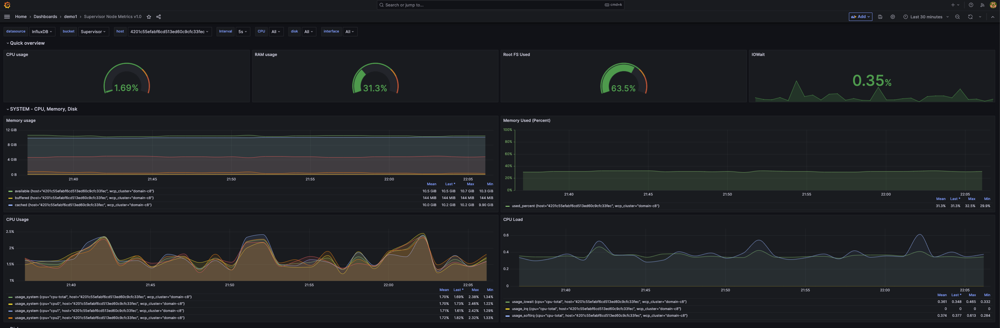

# Supervisor-Dashboard

## Dashboard 1 - CPU/Memory/Disk/Networking metrics. 




---

## Dashboard 2 - Kubernetes metrics. 


---

Changes to be made to the Supervisor Telegraf Configmap

```
    [[outputs.influxdb_v2]]
       urls = ["https://vmware-influxdb.demo1.svc.cluster.local"]
       organization = "VMware"
       token = "{{INFLUXDB API TOKEN}}"
       bucket = "Supervisor"
       insecure_skip_verify = true
```

